# 🛡️ BantAI: The Autonomous Cloud Guardian

**BantAI** (derived from the Filipino word *Bantay*, meaning sentinel or guardian) is a stateful, multi-agent AI system engineered to hunt and remediate cloud security threats autonomously. 

Developed as a "Privacy-First" AIOps platform, BantAI leverages local Large Language Models (LLMs) to ensure that sensitive infrastructure logs and security configurations never leave the local environment, providing enterprise-grade security without third-party data exposure.

---

## 🧠 System Architecture

BantAI utilizes **LangGraph** to orchestrate a sophisticated "Sensing-to-Remediation" workflow. Unlike traditional linear scripts, BantAI maintains a persistent state, allowing specialized agents to collaborate, validate results, and self-correct.

```mermaid
graph TD
    subgraph Local_Environment ["Privacy-First Stack"]
        Ollama[(🤖 Ollama Brain<br/>Llama3 & CodeLlama)]
        Logs[📄 Mock Cloud Logs]
    end

    subgraph BantAI_Brain ["LangGraph Orchestrator"]
        Start((Start)) --> Observer["🕵️ Observer Node"]
        Observer --> Router{"Threat Found?"}
        
        Router -- "Low Threat" --> End((Stop))
        Router -- "Med/High" --> Architect["🏗️ Architect Node"]
        
        Architect --> Validator["🛠️ Validator Tool"]
        Validator -- "Pass" --> Remediation["✅ Apply HCL Fix"]
        Validator -- "Fail" --> Architect
    end

    Logs --> Observer
    Ollama <--> Observer
    Ollama <--> Architect
    Remediation --> End

    style Start fill:#f9f,stroke:#333
    style End fill:#f9f,stroke:#333
    style Observer fill:#bbf,stroke:#333
    style Architect fill:#bbf,stroke:#333
    style Validator fill:#ffb,stroke:#333
    style Ollama fill:#dfd,stroke:#333
```



---

## 🚀 Key Features

* **Privacy-First AI:** Fully integrated with **Ollama** for 100% local inference. Ensures data sovereignty for sensitive security telemetry.
* **Stateful Agentic Orchestration:** Built on **LangGraph** to handle complex, non-linear decision-making and agent memory.
* **Automated Remediation:** Transitions from simple alerting to active defense by generating production-ready **Terraform (HCL)** code.
* **Self-Healing Logic:** Features a deterministic validation loop where proposed fixes are checked for syntax and logic before deployment.
* **AIOps Ready:** Fully containerized with **Docker**, designed for seamless migration to **Kubernetes (k8s)** environments.

---

## 🛠️ Technical Stack

| Component | Technology |
| :--- | :--- |
| **Language** | Python 3.11 |
| **AI Engine** | Ollama (Llama 3 for Logic, CodeLlama for HCL) |
| **Orchestration** | LangGraph & LangChain |
| **Infrastructure** | Terraform & Docker |
| **Governance** | Custom Python Validation Suite |

---

## 🏁 Getting Started

### 1. Prerequisites
Ensure you have **Docker** and **Docker Compose** installed on your machine.

### 2. Clone the Repository
```bash
git clone [https://github.com/your-username/bantai.git](https://github.com/your-username/bantai.git)
cd bantai
```

### 3. Initialize the Brain
Start the local LLM inference server and pull the required models:
```bash
docker compose up -d
docker exec -it bantai-brain ollama pull llama3
docker exec -it bantai-brain ollama pull codellama
```

### 4. Run the Autonomous Sentinel
Execute the full detection-to-remediation graph:
```bash
docker compose run bantai-agent python -m agents.bantai_core.graph
```

---

## 👨‍💻 About the Author

**Rodel** is a Senior Cloud Engineer and AI Researcher focused on the intersection of Global Information Security and Autonomous Systems. 

* **Professional:** Sr. Cloud Engineer at Sony's Global Information Security Division.
* **Academic:** Researching Artificial Intelligence through Georgia Tech's OMSCS program.

---